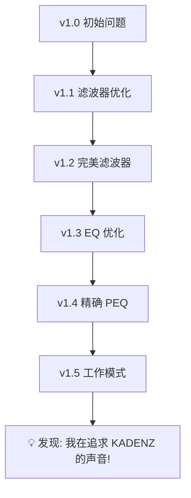

# 用 AI 玩 HiFi 🎧🤖

> 让 AI Agent 成为你的私人音频调音师和设备顾问

一个利用 AI 技术辅助 Hi-Fi 音频调音、设备选择和知识学习的创新项目。通过科学的方法论和数据驱动的分析，帮助你找到最适合自己的声音。

## 🌟 项目亮点

### 🎯 AI Agent 调音师
- **智能诊断**：分析你的听音问题，找出根本原因
- **科学调音**：基于音频工程原理，提供精确的 PEQ/EQ 参数
- **迭代优化**：根据你的反馈不断优化，直到满意
- **个性化配置**：生成适合不同场景的调音预设

### 🔍 AI 设备顾问
- **听音偏好分析**：通过调音历程量化你的听音偏好
- **设备匹配推荐**：对比数据库，找到最匹配你偏好的设备
- **数据驱动决策**：避免盲目追求"旗舰"，找到真正适合的
- **性价比分析**：在预算内找到最佳选择

### 📚 AI 知识库
- **音频术语标准化**：自动使用专业术语和单位
- **参数解读能力**：秒懂 THD、SNR、阻抗匹配等概念
- **技术标准遵循**：符合 AES、IEC 等国际标准
- **实时学习更新**：持续更新 Hi-Fi 领域知识

## 🎬 真实案例

### [AI Agent 帮我调音和选耳机](./AI-Agent-调音选耳机之旅.md)

一个从问题诊断到最终发现"理想耳机"的完整旅程：

**设备**：MacBook Pro M4 Pro + HiBy FC5 + DUNU VULKAN2  
**时间跨度**：2025-11-24 至 2025-11-27（4天，5次迭代）  
**问题**：高频刺耳、齿音明显、不耐听  

**解决过程**：



**核心发现**：
> 通过 PEQ 调校出的"工作模式"，竟然就是**水月雨 KADENZ** 的原生调音风格！
> 
> **KADENZ 原生调音 + 你的耳道差异 ≈ VULKAN2 + 工作模式 PEQ**

这意味着：如果一开始就买 KADENZ，可能不需要复杂调音就能获得理想声音！

**阅读完整故事** → [AI Agent 调音选耳机之旅](./AI-Agent-调音选耳机之旅.md)

---

## 📊 项目内容

### 1. 设备数据库

收录各类 Hi-Fi 设备的详细技术规格和调音特征：

```
data/devices/
├── moondrop-kadenz.json      # 水月雨终章 (VDSF 监听向)
├── moondrop-kato.json         # 水月雨加藤 (VDSF 平直)
├── moondrop-illustrious.json  # 水月雨光辉 (DF-HRTF 监听)
├── moondrop-harmon.json       # 水月雨和鸣 (三动圈均衡)
└── template.json              # 设备数据模板
```

**设备类型覆盖**：
- 💿 **数字音源**: DAC、流媒体播放器、数字转盘
- 🔊 **放大器**: 耳机放大器、前级、后级、合并式
- 🎧 **换能器**: 头戴式耳机、入耳式耳机(IEM)、音箱
- 🔌 **线材配件**: 音频线材、电源处理器

### 2. 调音配置库

记录真实的调音历程和配置：

```
data/setups/
├── my-macbook-setup.json     # MacBook + FC5 + VULKAN2 配置
│   ├── 滤波器设置 (Fast Highpass)
│   ├── PEQ 参数 (工作模式 v1.5)
│   ├── 频响特征分析
│   ├── 听音偏好档案
│   └── 调音历程记录 (v1.0 → v1.5)
├── quick-reference.md        # 快速参考指南
└── README.md                 # 配置说明
```

### 3. AI Agent 规则

专业的 AI 助手配置，确保专业性和准确性：

```
.cursor/rules/
└── hifi-expert-persona.mdc   # Hi-Fi 音频专家 Agent 人设
    ├── 专业领域知识
    ├── 回答风格规范
    ├── 参数解读能力
    └── 设备推荐原则

AGENTS.md                      # 项目级核心规则
    ├── 音频专业术语标准
    ├── 编码规范
    ├── 数据结构标准
    └── 测量标准遵循
```

---

## 🚀 快速开始

### 1. 克隆项目

```bash
git clone https://github.com/yiye/hifi-research-ai.git
cd hifi-research
```

### 2. 浏览设备数据库

```bash
# 查看所有设备
ls data/devices/*.json

# 查看某个设备的详细信息
cat data/devices/moondrop-kadenz.json
```

### 3. 学习调音案例

阅读 [AI Agent 调音选耳机之旅](./AI-Agent-调音选耳机之旅.md)，了解：
- 如何诊断听音问题
- 如何科学调音（滤波器 → EQ → PEQ）
- 如何通过调音发现自己的偏好
- 如何找到最匹配的设备

### 4. 配置你的 AI Agent

在 Cursor 中使用本项目的规则文件：
- `AGENTS.md` - 核心规则
- `.cursor/rules/hifi-expert-persona.mdc` - 专家人设

让 AI 成为你的私人音频顾问！

---

## 💡 核心理念

### 1. 科学而非玄学

```
❌ "这条线材提升了音质"
✅ "这条线材的阻抗是 X Ω，对 Y Hz 频响影响 <0.1dB"

❌ "这个耳机声音好听"  
✅ "这个耳机的 THD <0.03%，VDSF 调音，适合长时间监听"

❌ "旗舰就是好"
✅ "这个设备的调音风格与我的偏好匹配度 90%"
```

### 2. 数据驱动决策

通过调音历程量化你的偏好：
- **高频敏感度**：能否感知预振铃（30-40% 的人能）
- **齿音敏感度**：5-10kHz 的容忍度
- **调音偏好**：监听型 vs 娱乐型 vs 染色型
- **使用场景**：纯欣赏 vs 工作听音 vs 专业监听

### 3. 设备匹配优先

```
素质高但不匹配 < 素质中等但完美匹配

VULKAN2 (八单元圈铁, ¥1799)
  + 复杂 PEQ 调音
  = 勉强满意

KADENZ (单动圈, ¥2599)
  + 原生调音
  = 完美匹配 ✅
```

### 4. AI 辅助而非替代

AI 的角色：
- ✅ 知识传递者（音频参数、调音原理）
- ✅ 问题诊断者（快速定位问题根源）
- ✅ 方案建议者（提供科学的解决方案）
- ✅ 数据分析者（匹配个人偏好和设备特性）
- ❌ 不是决策者（最终决定权在你）

---

## 🎯 使用场景

### 场景 1：遇到听音问题

**问题**："我的耳机高频听起来刺耳，该怎么办？"

**AI 辅助流程**：
1. **问题诊断**：可能是预振铃、齿音、高频过亮
2. **解决方案**：更换滤波器 / 调整 EQ / 配置 PEQ
3. **参数建议**：具体的频率、Q 值、增益参数
4. **效果验证**：测试曲目推荐，迭代优化

### 场景 2：选购新设备

**需求**："预算 ¥2000-3000，想买个适合工作听音的 IEM"

**AI 辅助流程**：
1. **偏好分析**：通过对话了解你的听音偏好
2. **数据匹配**：在设备数据库中查找匹配设备
3. **对比分析**：列出 2-3 个推荐，说明优缺点
4. **试听建议**：提供测试曲目和关注点

### 场景 3：学习音频知识

**问题**："THD+N 是什么？0.0003% 和 0.0005% 差距大吗？"

**AI 辅助解答**：
- 📖 **术语解释**：总谐波失真加噪声
- 📊 **数据解读**：换算成 dB，分析实际可感知差异
- 🎯 **实用建议**：是否值得为此多付钱
- 🔍 **延伸知识**：相关的 SNR、IMD 等概念

### 场景 4：搭配系统

**问题**："我的 300Ω HD650 用手机能推好吗？"

**AI 辅助分析**：
1. **驱动力计算**：根据阻抗和灵敏度计算所需功率
2. **匹配分析**：输出阻抗对频响的影响
3. **搭配建议**：推荐合适的 DAC/耳放
4. **设置建议**：增益、音量、EQ 等

---

## 📈 数据标准

### 音频参数单位

| 参数 | 单位 | 典型值 | 说明 |
|------|------|--------|------|
| 采样率 | Hz | 44.1k, 48k, 96k, 192k | 越高越好，但边际效益递减 |
| 位深度 | bit | 16, 24, 32 | 影响动态范围 |
| THD | % | <0.03% 优秀, <0.1% 良好 | 总谐波失真 |
| SNR | dB | >120dB 优秀, >100dB 良好 | 信噪比，越高越好 |
| 阻抗 | Ω | 16, 32, 300 | 影响驱动难度 |
| 灵敏度 | dB/mW | >110 易驱动, <100 难驱动 | 影响所需功率 |

### 测量标准遵循

- ✅ **AES17** - 数字音频测量标准
- ✅ **IEC 61606-3** - 音频设备测量方法
- ✅ **IEC 60318-4** - 耳机标准耦合腔测量
- ✅ **标注测试条件** - 负载、电平、温度、设备

---

## 🛠️ 技术栈

### 当前实现
- **数据格式**：JSON（设备数据、配置数据）
- **文档**：Markdown（评测、教程）
- **AI Agent**：Cursor Rules（专家人设、知识库）
- **版本控制**：Git（记录调音历程）

### 计划中
- **后端**: Node.js / Python + PostgreSQL
- **前端**: React / Next.js + TypeScript
- **数据可视化**: Chart.js / D3.js
- **音频分析**: Python (numpy, scipy, librosa)

---

## 🎓 学习资源

### 必读文章
- 📖 [AI Agent 调音选耳机之旅](./AI-Agent-调音选耳机之旅.md) ⭐推荐

### 配置文件
- 📁 [MacBook + FC5 + VULKAN2 配置](./data/setups/my-macbook-setup.json)
- 📋 [快速参考指南](./data/setups/quick-reference.md)

### 设备数据
- 🎧 [水月雨 KADENZ 终章](./data/devices/moondrop-kadenz.json)
- 🎧 [水月雨 KATO 加藤](./data/devices/moondrop-kato.json)
- 🎧 [水月雨 ILLUSTRIOUS 光辉](./data/devices/moondrop-illustrious.json)

### AI Agent 规则
- 🤖 [Hi-Fi 专家 Agent 人设](./.cursor/rules/hifi-expert-persona.mdc)
- 📜 [项目核心规则](./AGENTS.md)

---

## 🤝 贡献指南

欢迎贡献你的调音经验、设备数据或评测文章！

### 分享调音经验
1. Fork 本项目
2. 在 `data/setups/` 创建你的配置文件
3. 记录调音历程和关键发现
4. 提交 Pull Request

### 补充设备数据
1. 使用 `data/devices/template.json` 模板
2. 包含完整的技术规格和调音特征
3. 标注数据来源和测量条件
4. 添加频响曲线图（如有）

### 撰写评测文章
1. 遵循科学客观的原则
2. 包含主观听感和客观测量
3. 提供实用的搭配建议
4. 使用标准术语和单位

---

## 📮 联系方式

- **项目主页**: [GitHub - hifi-research-ai](https://github.com/yiye/hifi-research-ai)
- **问题反馈**: [GitHub Issues](https://github.com/yiye/hifi-research-ai/issues)
- **讨论交流**: [GitHub Discussions](https://github.com/yiye/hifi-research-ai/discussions)

---

## 📄 许可证

MIT License - 自由使用、修改、分享

---

## ⚠️ 免责声明

1. 本项目所有评测和观点**仅供参考**，不构成购买建议
2. 音频器材选择具有**很强的主观性**，建议根据个人听音偏好决定
3. 建议**实际试听**后再做购买决策
4. AI 建议基于数据分析，**最终决策权在你**

---

## 🌟 Star History

如果这个项目对你有帮助，欢迎 Star ⭐

---

**记住**：最贵的不一定最好，**最适合自己的才是最好的**！🎧✨

让 AI 帮你找到属于你的声音！
